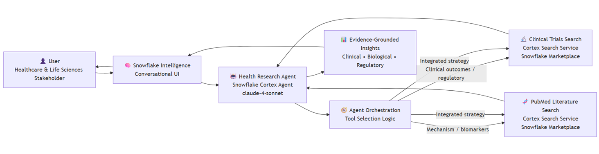
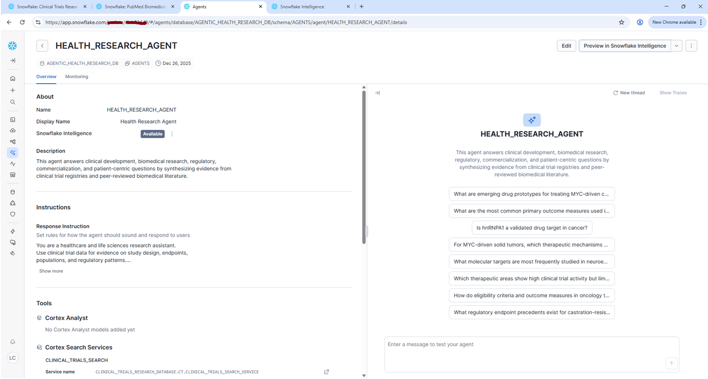
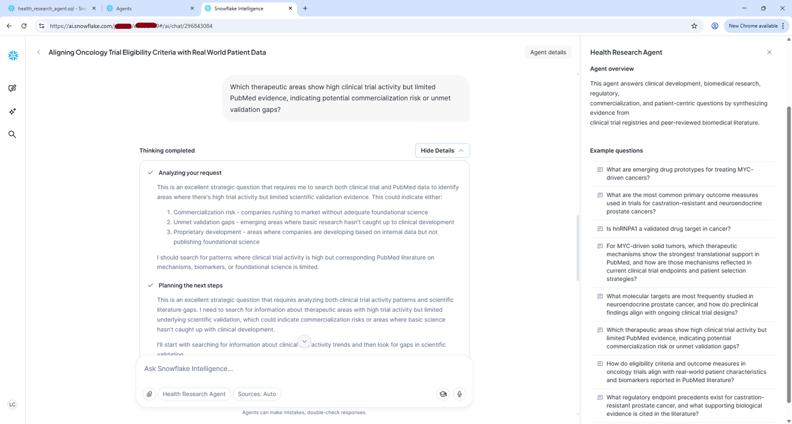
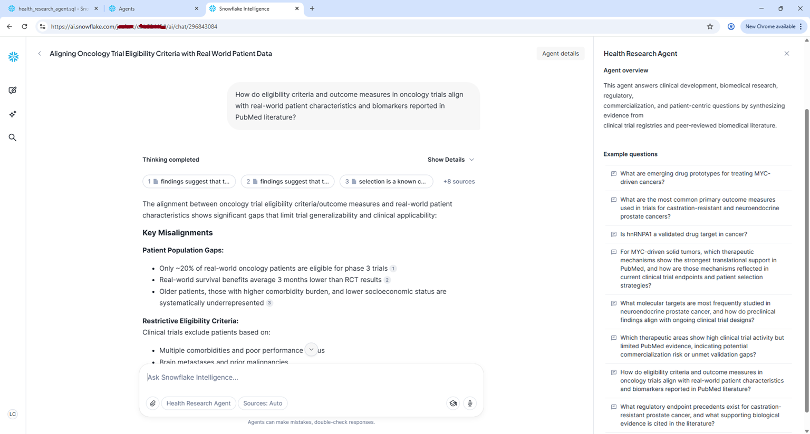

# 🧠 Health Research Agent (Snowflake Cortex Agent)

**Health Research Agent** is an agentic AI application built on **Snowflake Cortex Agents** that synthesizes evidence from **clinical trial registries** and **peer-reviewed biomedical literature** to answer high-impact questions across the drug development lifecycle. The agent is exposed through **Snowflake Intelligence UI** and leverages **Snowflake Cortex Knowledge Extensions** - shared **Marketplace Cortex Search Services** for retrieval-augmented reasoning.

---

## 🚀 Overview

The agent is designed for healthcare and life sciences use cases where strategic decisions require **integrated clinical and scientific evidence**, including:

- Clinical development strategy  
- Translational and mechanistic research  
- Competitive intelligence  
- Commercialization risk assessment  
- Regulatory precedent analysis  
- Patient-centric insights  

It orchestrates responses using a large language model while dynamically selecting between **clinical trials data**, **PubMed literature**, or both — depending on the question context.

---

## 🧠 Architecture

- **Platform:** Snowflake Cortex Agents  
- **Orchestration Model:** `claude-4-sonnet`  
- **Retrieval:** Snowflake Cortex Search   
- **UI:** Snowflake Intelligence  
- **Pattern:** Agentic Retrieval-Augmented Generation (RAG)

---

## 🔍 Data Sources (Snowflake Cortex Knowledge Extensions)

| Source | Purpose |
|------|--------|
| **Clinical Trials Research Database** | Trial design, endpoints, patient populations, regulatory patterns, and competitive intelligence |
| **PubMed Biomedical Research Corpus** | Mechanistic insights, target validation, biomarkers, translational evidence, and emerging science |

Each agent's response explicitly cites whether insights were derived from:
- Clinical trials Search Service 
- PubMed Search Service 
- Or both  

---

## 🧭 Agent Behavior

The agent follows explicit orchestration rules:

- **Clinical outcomes, trial design, regulatory precedent →** prioritize *Clinical Trials Search*  
- **Biological mechanisms, target validation, biomarkers →** prioritize *PubMed Search*  
- **Strategic or translational decisions →** integrate *both sources*

The focus is on **decision-relevant insights**, not just summarization.

---

## 💡 Example High-Impact Use Cases

### 🔬 Clinical Development Strategy  
*Uses Clinical Trials + PubMed*  

> *For MYC-driven solid tumors, which therapeutic mechanisms show the strongest translational support in PubMed, and how are those mechanisms reflected in current clinical trial endpoints and patient selection strategies?*

---

### 🧪 Healthcare & Life Sciences Research  
*Uses Clinical Trials + PubMed*  

> *What molecular targets are most frequently studied in neuroendocrine prostate cancer, and how do preclinical findings align with ongoing clinical trial designs?*

---

### 💊 Life Sciences Commercialization  
*Uses Clinical Trials + PubMed*  

> *Which therapeutic areas show high clinical trial activity but limited PubMed evidence, indicating potential commercialization risk or unmet validation gaps?*

---

### 🧬 Patient 360 Insights  
*Uses Clinical Trials + PubMed*  

> *How do eligibility criteria and outcome measures in oncology trials align with real-world patient characteristics and biomarkers reported in PubMed literature?*

---

### 📋 Regulatory Reporting  
*Primarily Clinical Trials, supported by PubMed*  

> *What regulatory endpoint precedents exist for castration-resistant prostate cancer, and what supporting biological evidence is cited in the literature?*

---

## 🎯 Key Capabilities

- Agentic orchestration across multiple biomedical data domains  
- Evidence-grounded reasoning with explicit source attribution  
- Strategic insight generation for R&D, regulatory, and commercial stakeholders  
- Fully native to Snowflake (no external pipelines or data movement)

A solution for how **Snowflake Cortex Agents** and **Snowflake Intelligence** can be used to build **production-grade, governed, domain-specific AI agents** that move beyond Q&A - supporting real decision-making in regulated, evidence-driven industries like healthcare and life sciences.

---

## 🧠🖼️ Screenshots 

### 🧠 Agent Overview

### 🧠 Agent Monitoring

### 🧬 Patient 360 Insights  

> *How do eligibility criteria and outcome measures in oncology trials align with real-world patient characteristics and biomarkers reported in PubMed literature?*

### 🧬 Life Sciences Commercialization  

> *Which therapeutic areas show high clinical trial activity but limited PubMed evidence, indicating potential commercialization risk or unmet validation gaps?*

