# ⚕️ Clinical Trials Analytics in Snowflake 

An end-to-end data pipeline and analytics dashboard for clinical trials data using Snowflake and Streamlit in Snowflake.
> Ingest, normalize, and explore clinical study data from ClinicalTrials.gov.

## ❄️ Overview

- The pipeline found in __`Clinical_Trials_Analytics_Pipeline_Snowflake.ipynb`__ notebook starts with the ingestion of semi-structured JSON data from [clinicaltrials.gov REST API](https://clinicaltrials.gov/api/v2/studies/NCT02953860). The pipeline uses Snowflake's `external access integration` and a Python-based `UDF` to fetch and store raw JSON data into Snowflake tables. The data is then flattened and transformed using `Snowpark` into a set of normalized, query-optimized tables suitable for analysis and reporting. The final component is a `Streamlit` app — hosted directly in Snowflake — that visualizes study design, outcomes, baseline measures, adverse events, locations, and documents.

---

## 🧱 Architecture

- **Data Source**: ClinicalTrials.gov REST API
- **Ingestion**: Python UDF with external access integration
- **Storage**: Snowflake table with VARIANT column for semi-structured JSON
- **Transformation**: Snowpark DataFrames and flattening logic
- **Normalization**: Structured tables (e.g., study design, locations, outcomes, baseline measures, adverse events)
- **Dashboard**: Streamlit in Snowflake

---

 ## 📊 Features

- Ingestion of clinical trial records via REST API
- Deeply nested JSON flattening via Snowpark
- Normalized schema for core entities:
  - Study metadata
  - Study locations
  - Study design
  - Outcome measures (primary/secondary)
  - Baseline measures (sex, age, race, region of enrollment)
  - Adverse events (serious/other)
  - Trial documents
  - Trial limitations
- Interactive dashboard using Streamlit
  - Tabbed navigation
  - Mapped locations
  - Plotly charts for participant counts, outcomes, baseline and adverse events broken down by type and various measures

---

## 📂 Project structure
<pre>
├── notebooks/
│ ├── Clinical_Trials_Analytics_Pipeline_Snowflake.ipynb (Python UDF + Snowpark logic)
├── streamlit/
│ ├── streamlit_app.py # Streamlit dashboard code
│ ├── environment.yml 
├── images/ # Streamit Dashboard screenshots
├── README.md
</pre>

---

## 📎 Dashboard

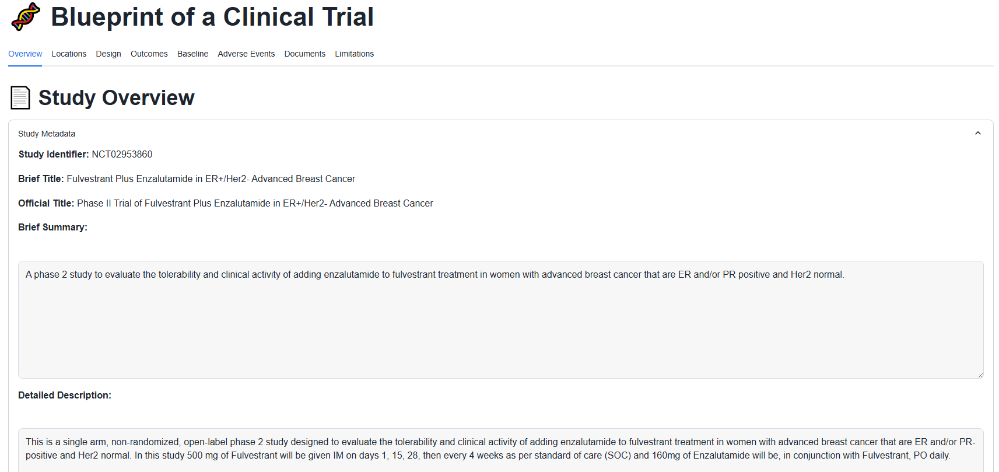
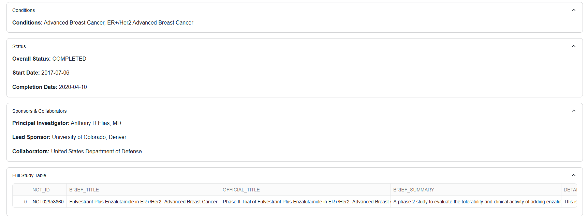
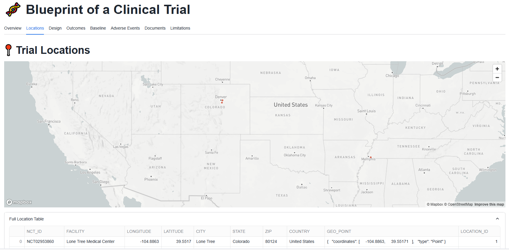
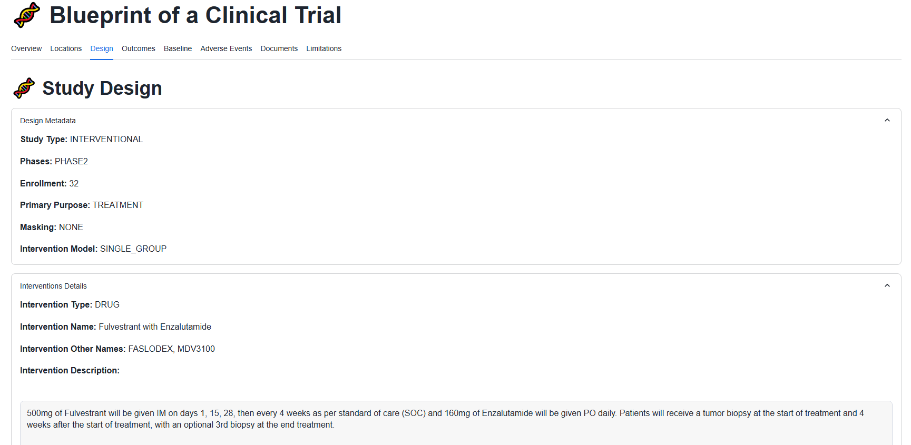
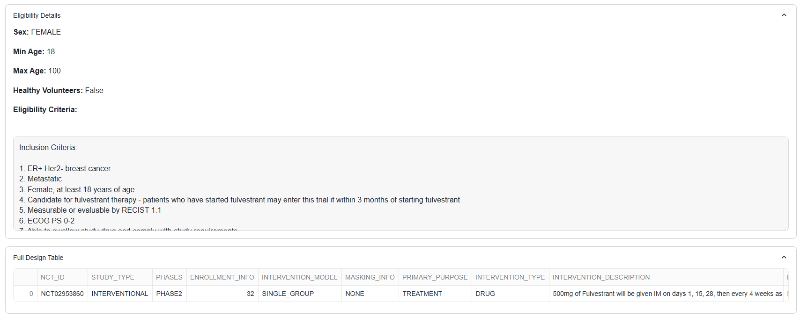
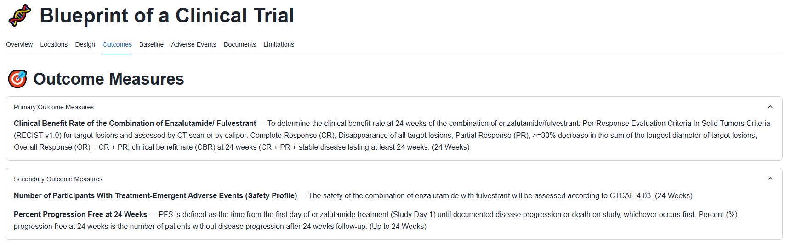
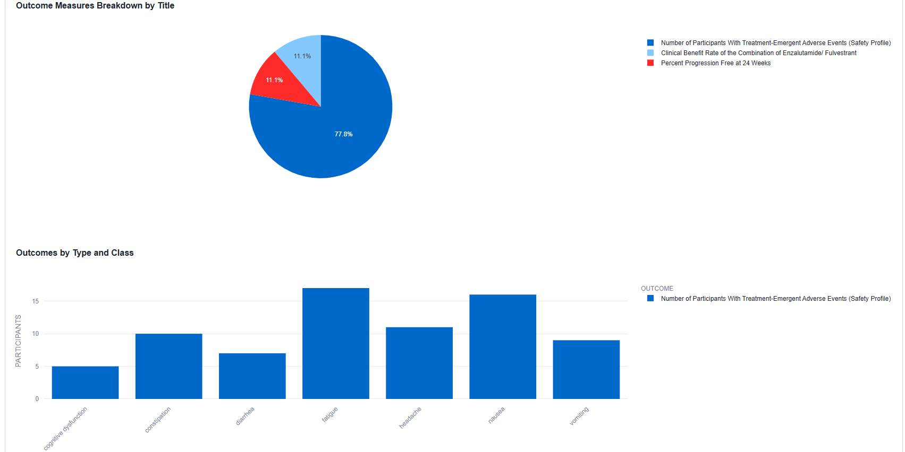
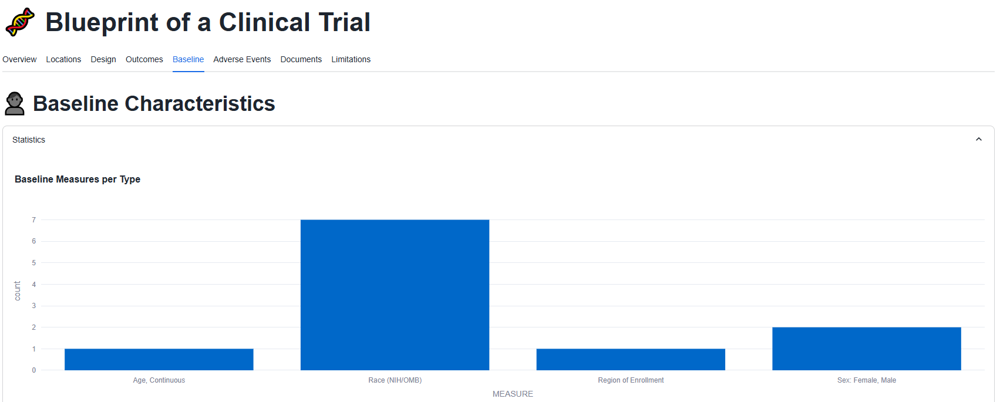
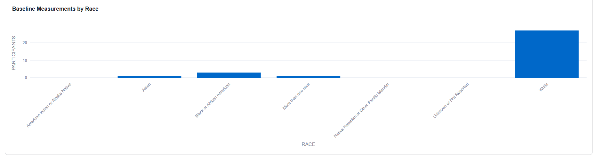
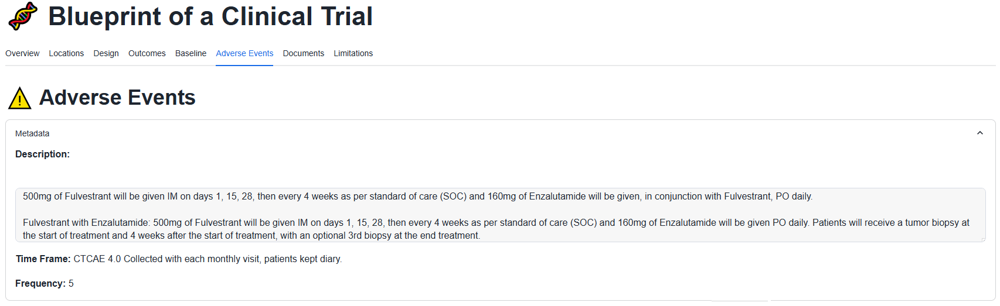
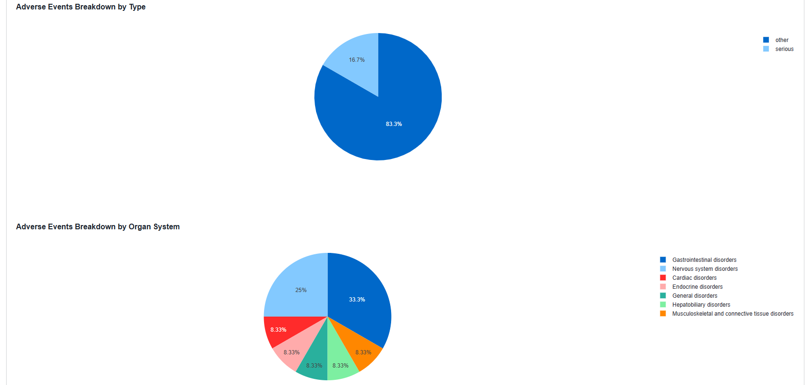
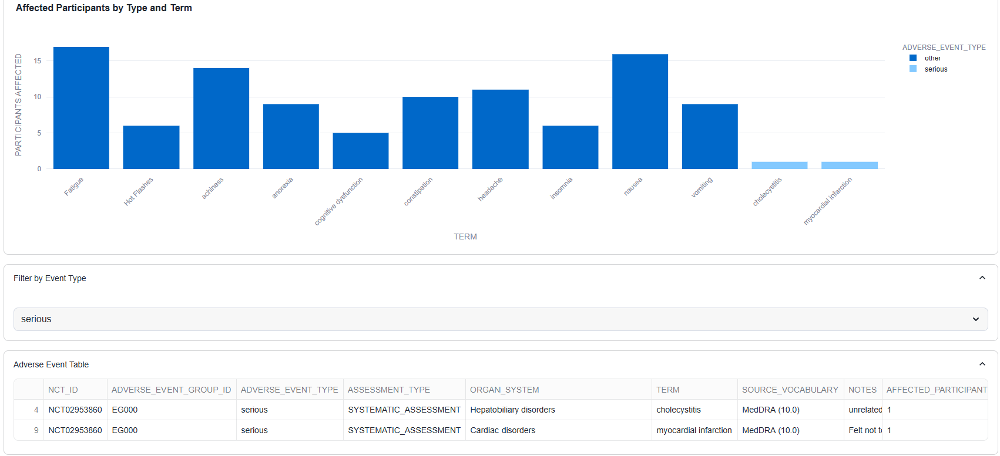
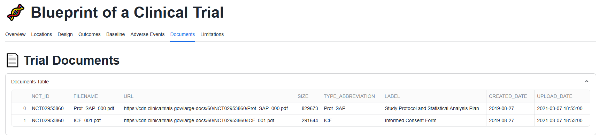
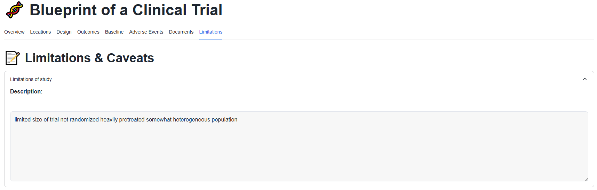

