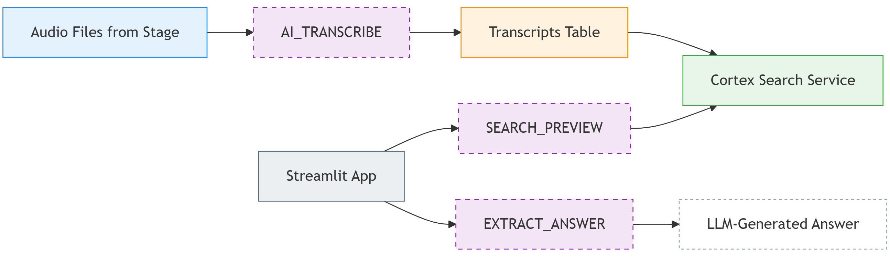
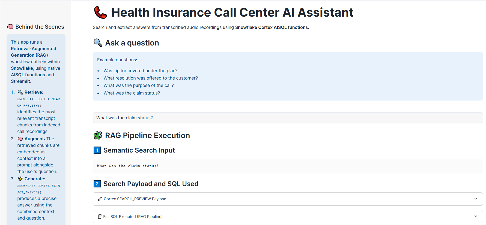
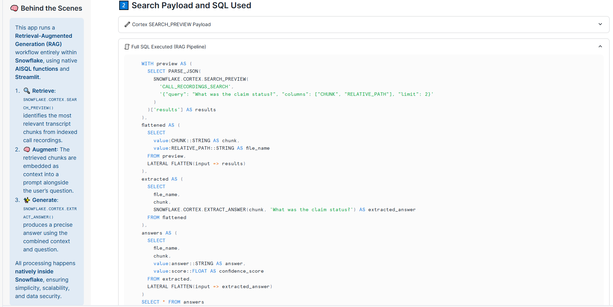
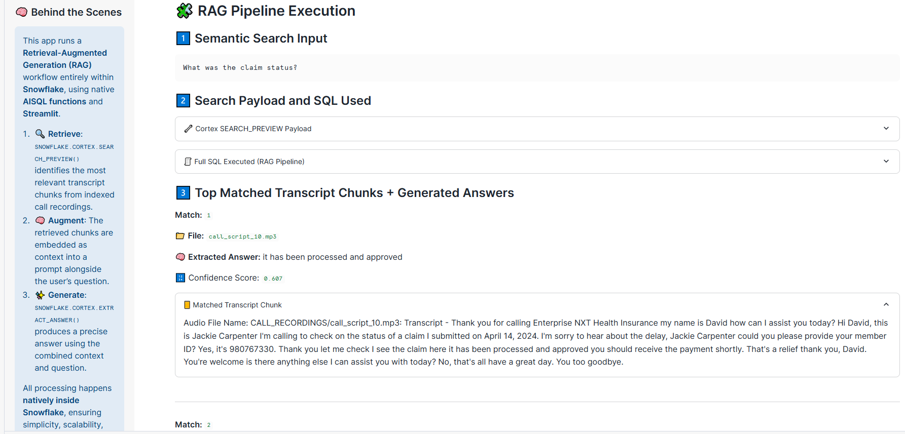
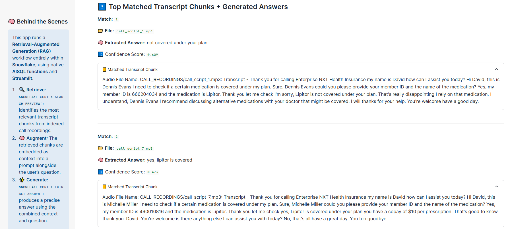

# 📞 Health Insurance Call Center AI Assistant

This project demonstrates a real-world **Retrieval-Augmented Generation (RAG)** pipeline using **Snowflake Cortex AISQL functions** to gain insights into health insurance-related service calls — coverage, billing, claims — from **AI transcribed audio recordings**.

---

## 🚀 Features

✅ Natural language Q&A over call transcripts  
✅ Fully Snowflake-native (no external APIs or infrastructure)  
✅ Audio-to-Text using `AI_TRANSCRIBE()`  
✅ Semantic retrieval via `SNOWFLAKE.CORTEX.SEARCH_PREVIEW()`  
✅ LLM-based answer generation via `SNOWFLAKE.CORTEX.EXTRACT_ANSWER()`  
✅ Fully interactive UI with **Streamlit in Snowflake**  

---

## 🏗️ Architecture



---

## 📂 Project structure
<pre>
├── data/
│ ├── call_recordings/ # mp3 audio files 
├── scripts/
│ ├── setup.sql # create Snowflake objects (warehouse, database, schema, stage, tables, cortex search service)
├── streamlit/
│ ├── streamlit_app.py # Streamlit chat app using Cortex Search Service as a RAG engine combined with Cortex AISQL functions
│ ├── environment.yml 
├── images/ # architecture & screenshots
├── README.md
</pre>

## 📥 Data Ingestion & Transcription

**`.mp3` audio files** are loaded from Snowflake stage and **transcribed into text** using **`AI_TRANSCRIBE()`**:

```sql
-- Load audio files from stage into a table
CREATE OR REPLACE TABLE CALL_RECORDINGS AS
SELECT TO_FILE(FILE_URL) AS AUDIO_FILE, *
FROM DIRECTORY(@HC_AISQL_DB.HC_AISQL_SCHEMA.HC_AISQL_STAGE)
WHERE RELATIVE_PATH LIKE 'CALL_RECORDINGS/%';

-- Add column to store transcript text
ALTER TABLE CALL_RECORDINGS ADD COLUMN CALL_TRANSCRIPT STRING;

-- Transcribe audio to text using AI_TRANSCRIBE()
UPDATE CALL_RECORDINGS 
SET CALL_TRANSCRIPT = AI_TRANSCRIBE(AUDIO_FILE):text::STRING;
```

> The CALL_TRANSCRIPT is later used as the document chunk in semantic search.

---

## 🗂️ Cortex Search Service Setup

Generated transcripts are automatically indexed and embedded using Cortex Search Service. The service is used by the Streamlit app to semantically search across transcripts.

```sql
CREATE OR REPLACE CORTEX SEARCH SERVICE CALL_RECORDINGS_SEARCH
ON CHUNK
ATTRIBUTES RELATIVE_PATH
WAREHOUSE = HC_AISQL_WH
TARGET_LAG = '1 hour'
AS (
  SELECT    
    REGEXP_SUBSTR(RELATIVE_PATH, '[^/]+$') AS RELATIVE_PATH,
    'Audio File Name: ' || RELATIVE_PATH || ': Transcript - ' || CALL_TRANSCRIPT AS CHUNK
  FROM CALL_RECORDINGS
);
```
---

## 🧠 RAG Pipeline Execution using Snowflake-native AISQL functions

- 🔍 Retrieval — `SNOWFLAKE.CORTEX.SEARCH_PREVIEW()` identifies the most relevant transcript chunks from indexed call recordings.

- 🧠 Augmentation — Retrieved chunks are embedded as context into a prompt alongside the user’s question.

- ✨ Generation — `SNOWFLAKE.CORTEX.EXTRACT_ANSWER()` produces a precise answer using the combined context and question.

--- 

## 🖼️ Example User Questions

- "Was Lipitor covered under the plan?"

- "What was the purpose of the call?"

- "What resolution was offered to the customer?"

- "What was the claim status?"

## 📎 RAG Pipeline Screeshots

- "What was the claim status?"





- "Was Lipitor covered under the plan?"



