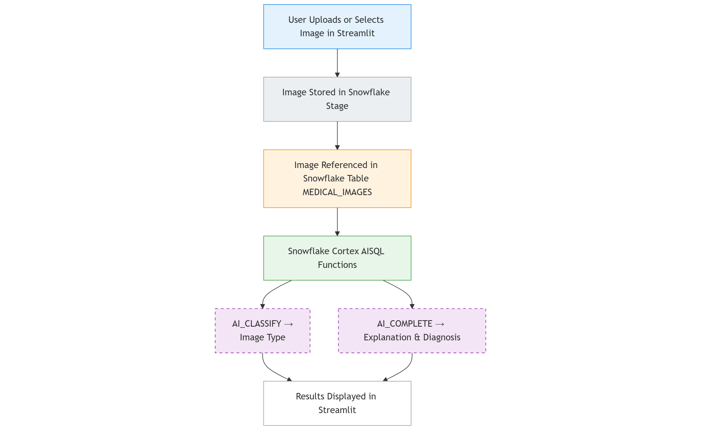
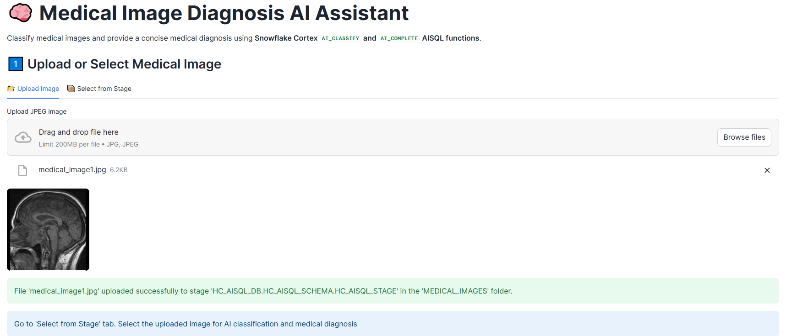
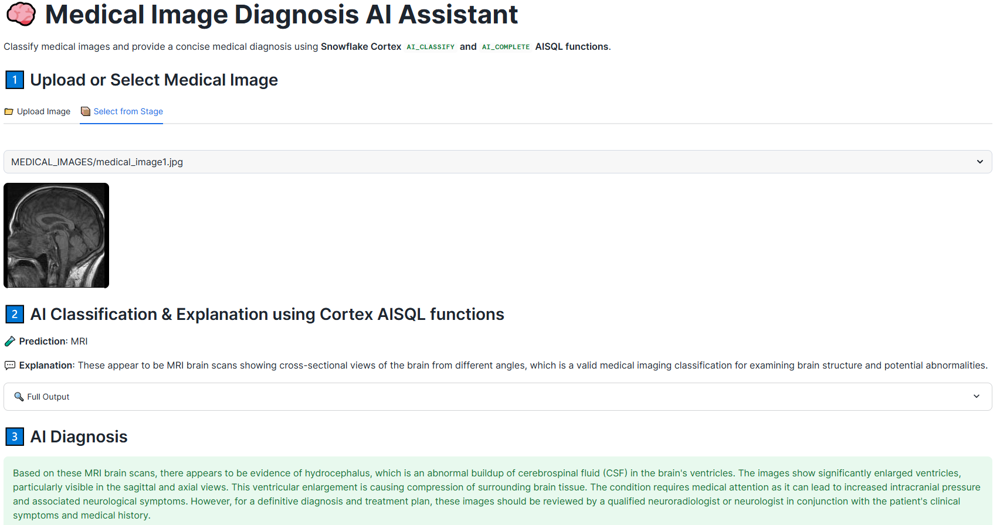
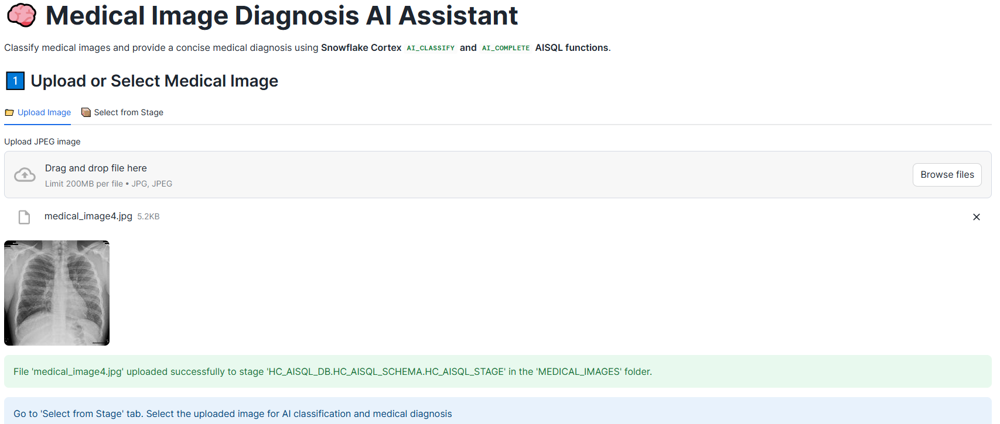
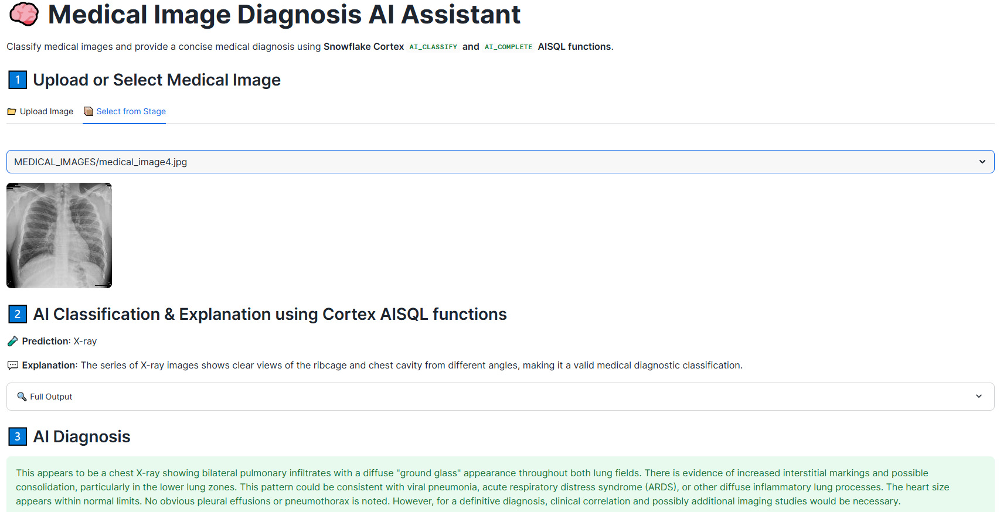
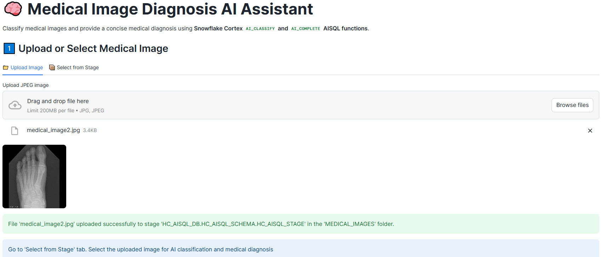
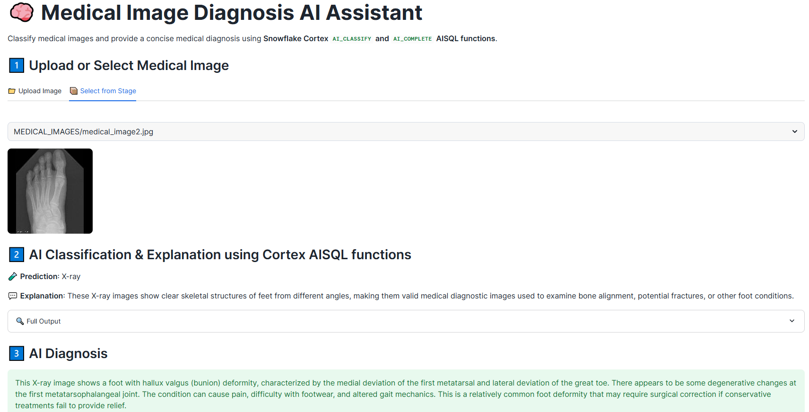
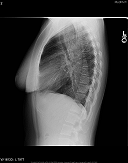
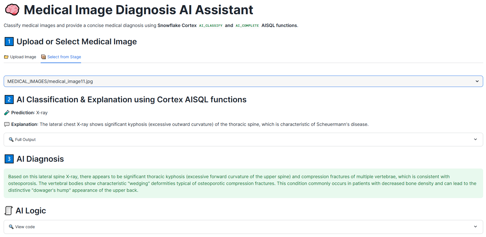

# 🧠 Medical Image Diagnosis AI Assistant

This project is a **Snowflake-native AI diagnosis assistant** built with **Streamlit** and **Snowflake Cortex AISQL functions**. It classifies medical images (like X-rays, CT scans, MRIs) and generates a concise medical **diagnosis** — all inside Snowflake using LLMs such as Claude 3.5 Sonnet.

---

## 📸 Features

- **Upload or select** medical images from a Snowflake stage
- **Classify** the image into known types using `AI_CLASSIFY`
- **Explain** the classification decision using `AI_COMPLETE`
- **Diagnose** the image content using `AI_COMPLETE` with a medical prompt
- All AI processing occurs directly **in Snowflake** using Cortex AISQL functions

---

## 🏗️ Architecture



---

## 📂 Project structure
<pre>
├── data/
│ ├── medical_images/ # jpg files 
├── scripts/
│ ├── setup.sql # create Snowflake objects (warehouse, database, schema, stage, table)
├── streamlit/
│ ├── streamlit_app.py # Streamlit app for data ingestion using Snowpark, categorization of images, reasoning and medical diagnosis using Cortex AISQL functions
│ ├── environment.yml 
├── images/ # architecture & screenshots
├── README.md
</pre>

---

## 🗂️ Setup

```sql
CREATE OR REPLACE WAREHOUSE HC_AISQL_WH;
CREATE OR REPLACE DATABASE HC_AISQL_DB;
CREATE OR REPLACE SCHEMA HC_AISQL_DB.HC_AISQL_SCHEMA;

CREATE OR REPLACE STAGE HC_AISQL_DB.HC_AISQL_SCHEMA.HC_AISQL_STAGE 
	DIRECTORY = ( ENABLE = true ) 
	ENCRYPTION = ( TYPE = 'SNOWFLAKE_SSE' );

CREATE OR REPLACE TABLE HC_AISQL_DB.HC_AISQL_SCHEMA.MEDICAL_IMAGES AS
  SELECT TO_FILE(FILE_URL) IMAGE_FILE, *
  FROM DIRECTORY(@HC_AISQL_DB.HC_AISQL_SCHEMA.HC_AISQL_STAGE)
  WHERE RELATIVE_PATH LIKE 'MEDICAL_IMAGES/%';
```
---

## 🧪 Diagnosis Pipeline

### 1️⃣ Upload or Select a Medical Image via Streamlit UI

- Drag-and-drop/browse to upload local .jpg files directly to internal Snowflake stage using Snowpark `session.file.put_stream()`. 
- OR choose from images in Snowflake's internal stage (`@HC_AISQL_STAGE/MEDICAL_IMAGES/`). Staged images are downloaded using Snowpark `session.file.get_stream()`

### 2️⃣ AI Classification & Explanation

- Uses `AI_CLASSIFY()` to classify the image (e.g., X-ray, CT, MRI, etc.)
- Uses `AI_COMPLETE()` to explain why that classification was chosen

```python
    # Run AI_CLASSIFY
    category_list = ['X-ray', 'CT', 'MRI', 'Ultrasound', 'PET', 'Other']
    classify_expr = call_function(
        "AI_CLASSIFY",
        prompt("Please classify this medical image {0}", col("IMAGE_FILE")),
        category_list
    )["labels"][0].cast("string").alias("classification")

    # Run AI_COMPLETE for explanation
    explanation_expr = call_function(
        "AI_COMPLETE",
        "claude-3-5-sonnet",
        prompt("Explain in one sentence why this is a valid classification for image {0}", col("IMAGE_FILE"))
    ).alias("explanation")

    result_df = (
        session.table("MEDICAL_IMAGES")
        .filter(col("RELATIVE_PATH") == selected_path)
        .select("RELATIVE_PATH", "IMAGE_FILE", classify_expr, explanation_expr)
        .to_pandas()
    )
```

### 3️⃣ AI Diagnosis
- Uses `AI_COMPLETE()` again with a specialized prompt to generate a  medical **diagnosis**.

```python
    # Run AI_COMPLETE to generate a diagnosis
    diagnosis_expr = call_function(
        "AI_COMPLETE",
        "claude-3-5-sonnet",
        prompt("Provide a concise medical diagnosis based on this image {0}.", col("IMAGE_FILE"))
    ).alias("final_diagnosis")

    # Run classification + explanation + diagnosis
    result_df = (
        session.table("MEDICAL_IMAGES")
        .filter(col("RELATIVE_PATH") == selected_path) 
        .select("RELATIVE_PATH", "IMAGE_FILE", 
        classify_expr, explanation_expr, diagnosis_expr)
        .to_pandas()
    )
```
---

## 📎 Screeshots

- Brain MRI scans




- Chest X-rays




- Foot X-rays




- Lateral Chest X-ray 




---

### 🛡️ Note
This tool is a **proof-of-concept** for demo purposes only and should not be used for actual medical diagnosis or patient treatment decisions. 

However, this app is well-suited for clinical research, prototyping diagnostic pipelines, or training models. It can be further developed to serve as a front-end to more advanced medical imaging LLM systems within healthcare environments.


